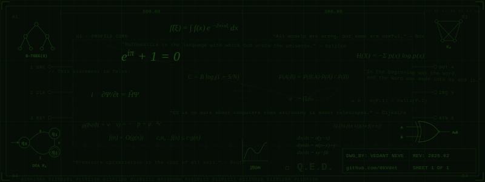
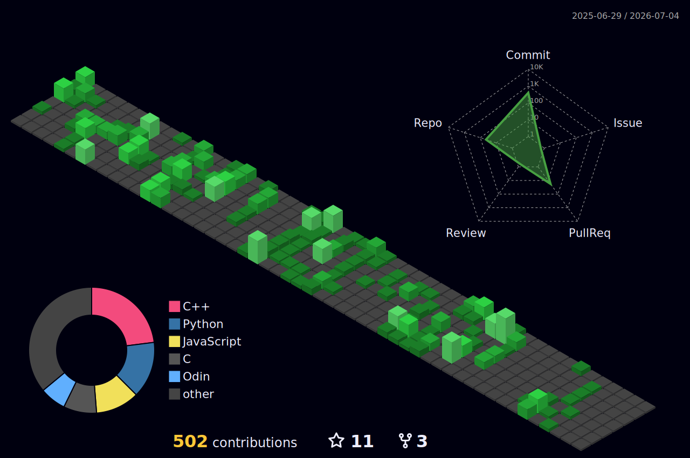

<p align="center">
  
</p>

# Hi, I'm Vedant 👋

📍 **Pune, India** · ⚙️ **Systems Programming, Compilers, AI/ML, Mathematics** · 🎓 **CS Undergrad @ SPPU**

## Tech Stack

**Languages**


**Compilers & Toolchains**


**GPU & Graphics**


**AI / ML**


**Web & Frameworks**


**Databases & ORM**


**DevOps & Infrastructure**


**OS & Environment**


**Tools**


## About Me
```
- I want to learn everything about everything!
- I build things that make me go "Huh, that's interesting!" and "Wow, I didn't know that was possible!", and then I write about them.
- I have a soft spot for compilers, low-level programming, GPU graphics, and performance optimization and I'm always up for exploring new domains and technologies.
```

## Featured Projects

- 🛞 **[Chakravyuha](https://github.com/0bVdnt/chakravyuha)** — LLVM obfuscation engine for C/C++: Control Flow Flattening, Polymorphic String Encryption, Fake Code Injection, Telemetry Pass
- 🎡 **[Chakra-Web-Service](https://github.com/0bVdnt/chakra-web-service)** — OaaS (Obfuscation as a Service) frontend with ephemeral Docker containers, report generation & CFG visualization · [Live Demo](https://chakravyuha-obfuscator.github.io/)
- 📖 **[obvcc](https://github.com/0bVdnt/obvcc)** — Minimal C compiler from scratch: lexer, recursive descent parser, semantic analysis, x64 assembly codegen
- 💡 **[Raylib-CUDA](https://github.com/0bVdnt/raylib_cuda)** — Zero-copy GPU graphics middleware bridging Raylib and CUDA via DMA; 80%+ boilerplate reduction with a developer-centric C API
- 🌐 **[HTTP-C](https://github.com/0bVdnt/http-c)** — HTTP/1.1 server from scratch in C; POSIX sockets, custom parser, 0 memory leaks, atomic graceful shutdown
- 👾 **[PixlGo](https://github.com/0bVdnt/pixlgo)** — High FPS terminal media player: concurrent goroutine pipeline, 24-bit TrueColor half-block rendering
- 💽 **[obv-OS](https://github.com/0bVdnt/obv-os)** — Operating system from scratch. Kernel development in progress — bootloader, memory management, and beyond

## Experiments

- 🍵 **[Jerm](https://github.com/0bVdnt/jerm)** — A Java based terminal emulator
- 🧬 **[GameOfLife-WebAssembly](https://github.com/0bVdnt/game-of-life-webassembly)** — Conway's Game of Life built with C++ and compiled to WebAssembly
- 🕹️ **[raylib-cuda-simulations](https://github.com/0bVdnt/raylib-cuda-simulations)** — A collection of GPU-accelerated simulations implemented using the [Raylib-CUDA](https://github.com/0bVdnt/raylib_cuda) middleware library
- 🎄 **[advent-of-code-rust-cpp-template](https://github.com/0bVdnt/advent-of-code-rust-cpp-template)** — A template repository for solving Advent of Code problems in Rust and C++
- 🧱 **[cuda-GL](https://github.com/0bVdnt/cuda-gl)** — GPU accelerated Graphics Components using CUDA and OpenGL
- 👁️ **[mnist-hyperparameter-experiment](https://github.com/0bVdnt/mnist-hyperparameter-experiment)** — A hyperparameter tuning experiment for MNIST dataset using TensorFlow/Keras
- 💰 **[PayWiz](https://github.com/0bVdnt/paywiz)** — A full-stack payments application demonstrating authentication, RESTful APIs, database transactions, and a modern React frontend
- 📃 **[Blogify](https://github.com/0bVdnt/blogify)** — A monorepo of a serverless edge backend (Cloudflare Workers + Prisma) and a React frontend, built with TypeScript
- 📒 **[NotesPlusPlus](https://github.com/0bVdnt/notesplusplus)** — A fast and responsive web app for note taking++

## Metrics

<div align="center">
  
</div>

<details>
<summary>⚡ Recent Activity</summary>
<br>

<!--RECENT_ACTIVITY:start-->
1. ⭐ Starred [zml/zml](https://github.com/zml/zml)<br>
2. ⭐ Starred [patrick-kidger/equinox](https://github.com/patrick-kidger/equinox)<br>
3. ⭐ Starred [vosen/ZLUDA](https://github.com/vosen/ZLUDA)<br>
4. ⭐ Starred [Yuliang-Liu/MonkeyOCR](https://github.com/Yuliang-Liu/MonkeyOCR)<br>
5. ⭐ Starred [tenstorrent/tt-metal](https://github.com/tenstorrent/tt-metal)<br>
<!--RECENT_ACTIVITY:end-->

</details>

<details>
<summary>📊 Weekly Development Breakdown</summary>
<br>

<!--START_SECTION:waka-->

```txt
From: 28 January 2026 - To: 27 February 2026

Markdown      1 hr 40 mins          ██████████████▒░░░░░░░░░░   57.92 %
YAML          44 mins               ██████▒░░░░░░░░░░░░░░░░░░   25.66 %
Other         18 mins               ██▓░░░░░░░░░░░░░░░░░░░░░░   10.79 %
Lua           4 mins                ▓░░░░░░░░░░░░░░░░░░░░░░░░   02.53 %
C++           2 mins                ▒░░░░░░░░░░░░░░░░░░░░░░░░   01.51 %
INI           2 mins                ▒░░░░░░░░░░░░░░░░░░░░░░░░   01.22 %
Image (svg)   0 secs                ░░░░░░░░░░░░░░░░░░░░░░░░░   00.37 %
```

<!--END_SECTION:waka-->

</details>

## Currently

- 💽 Learning about operating systems through **[obv-OS](https://github.com/0bVdnt/obv-os)**.
- 🔧 Adding new LLVM obfuscation passes to Chakravyuha.
- 🧠 Deep-diving into compiler internals, GPU programming, and mathematics.
- 🤖 Tinkering around and studying about Artificial Intelligence and Machine Learning.
- 📚 Writing and documenting while I learn everything.


### Philosophy

> To truly understand something, you must build it from the first principles up, and then break it down to its core components, and then put it back together again in a way that is uniquely your own.

<details>
<summary>Random Facts</summary>

- The header SVG contains a real Lorenz attractor (σ=10, ρ=28, β=8/3)
- The binary at the bottom of the blueprint decodes to "Hello World"
- The hex bytes `7f 45 4c 46` are the ELF header magic number
- Euler's identity is there because it's the most beautiful equation ever written
- I love computers and mathematics, so working around these does not feel like work to me at all, and I have a lot of fun doing it!
- I think `Q.E.D.` is the most satisfying thing you can write at the end of anything ∎

</details>

<p align="center">
  
</p>

<div align="center">
<pre><code>
⣿⣿⣿⣿⣿⣿⣿⣿⣿⣿⣿⣿⣿⣿⣿⣿⣿⣿⣿⣿⣿⡿⣿⡟⡿⢯⡻⡝⢯⡝⡾⣽⣻⣟⡿⣿⣿⣿⣿⣿⣿⣿⣿⣿⣿⣿⣿⣿⣿⣿⣿⣿⣿⣿⣿
⣿⣿⣿⣿⣿⣿⣿⣿⣿⣿⣿⣿⣿⣿⣿⣿⣿⣿⣿⢻⠳⣏⠧⠹⡘⢣⠑⠎⠱⣈⠳⢡⠳⢭⣛⠷⣟⣿⣿⣿⣿⣿⣿⣿⣿⣿⣿⣿⣿⣿⣿⣿⣿⣿⣿
⣿⣿⣿⣿⣿⣿⣿⣿⣿⣿⣿⣿⣿⣿⣿⣿⡿⣝⣎⢣⠡⠌⣢⠧⠒⠃⠁⠈⠉⠉⠑⠓⠚⠦⣍⡞⡽⣞⡿⣿⣿⣿⣿⣿⣿⣿⣿⣿⣿⣿⣿⣿⣿⣿⣿
⣿⣿⣿⣿⣿⣿⣿⣿⣿⣿⣿⣿⣿⣿⣿⡿⣝⠮⡜⣢⠕⠊⠁⠀⠀⠀⠀⠀⠀⠀⠀⠀⠉⠐⠄⡙⠲⣝⡺⡽⣿⣿⣿⣿⣿⣿⣿⣿⣿⣿⣿⣿⣿⣿⣿
⣿⣿⣿⣿⣿⣿⣿⣿⣿⣿⣿⣿⡿⣿⣿⡹⢎⣳⠞⡡⠊⠀⠀⠀⣀⣤⣤⣶⣶⣤⣤⣀⡈⠂⠄⠙⠱⡌⠳⣹⢎⡿⣿⣿⣿⣿⣿⣿⣿⣿⣿⣿⣿⣿⣿
⣿⣿⣿⣿⣿⣿⣿⣿⣿⣿⣿⡿⣽⣟⣳⡝⡼⢁⠎⠀⡀⢁⣴⣿⣿⣿⣿⣿⣿⣿⣿⣿⣿⣶⡄⠰⣄⠈⠓⢌⠛⢽⣣⡟⢿⠿⣿⣿⢿⣿⣿⣿⣿⣿⣿
⣿⣿⣿⣿⣿⣿⣿⣿⣿⣿⣿⣟⡿⣽⠳⡼⢁⡞⠀⡜⢰⣿⣿⣿⣿⣿⣿⣿⣿⣿⣿⣿⣿⣿⣿⡆⢸⢵⠀⠀⠁⠂⠤⣉⠉⠓⠒⠚⠦⠥⡈⠉⣙⢛⡿
⣿⣿⣿⣿⣿⣿⣿⣿⣿⣿⣟⡾⣽⣏⢳⢃⣞⠃⡼⢀⣿⣿⣿⣿⣿⣿⣿⣿⣿⣿⣿⣿⣿⣿⣿⣿⡄⠀⠀⠀⠀⠀⠀⠀⠀⠁⢀⣀⠤⠐⢋⡰⣌⣾⣿
⣿⣿⣿⣿⣿⣿⣿⣿⣿⣟⣮⢳⣿⠶⠁⠖⠃⠀⠁⢸⣿⣿⣿⣿⣿⣿⣿⣿⣿⣿⡿⠿⠿⠟⠛⠛⠀⠀⠀⠀⢀⡤⠤⠐⠒⣉⠡⣄⠶⣭⣿⣽⣿⣿⣿
⣿⣿⣿⣿⣿⣿⣿⡿⠿⢉⡢⠝⠁⠀⠃⠀⠀⠀⠀⠀⠿⠃⠿⠿⠿⠛⠋⠉⠁⠀⠀⠀⠀⠀⠀⠀⠀⠀⣀⠀⣀⢤⣰⣲⣽⣾⡟⣾⣿⣿⣿⣿⣿⣿⣿
⣿⣿⣟⡿⡚⠏⠁⠀⠐⠉⠀⠀⠀⠀⠀⠀⠀⠀⠀⠀⠀⠀⠀⠀⠀⠀⠀⠀⠀⠀⠀⠀⠀⠀⣠⠂⣠⠀⣯⣗⣮⢿⣷⣿⣿⣿⣿⣿⣿⣿⣿⣿⣿⣿⣿
⣿⢯⡝⠠⠁⠀⠀⠠⠤⠀⠀⠀⠀⡀⠢⣄⣀⡀⠐⠤⡀⠀⠀⠀⢤⣄⣀⠤⣄⣤⢤⣖⡾⠋⢁⡼⠁⣸⡿⣞⣽⣿⣿⣿⣿⣿⣿⣿⣿⣿⣿⣿⣿⣿⣿
⣿⣷⣾⣵⣦⣶⣖⣳⣶⣝⣶⣯⣷⣽⣷⣾⣶⣽⣯⣶⠄⠈⠒⣤⣀⠉⠙⠛⠛⠋⠋⢁⣠⠔⠁⠀⢰⣿⣽⣯⣿⣿⣿⣿⣿⣿⣿⣿⣿⣿⣿⣿⣿⣿⣿
⣿⣿⣿⣿⣿⣿⣿⣿⣿⣿⣿⣿⣿⣿⣿⣿⣿⣿⣿⣿⣷⣦⡄⡀⡉⠛⠓⠶⠶⠒⠛⠋⠀⠀⢀⣼⣻⢷⣾⣿⣿⣿⣿⣿⣿⣿⣿⣿⣿⣿⣿⣿⣿⣿⣿
⣿⣿⣿⣿⣿⣿⣿⣿⣿⣿⣿⣿⣿⣿⣿⣿⣿⣿⣿⣿⣿⣿⣾⣧⡵⣌⣒⢂⠀⣀⣀⣠⣤⣶⣿⣾⣿⣿⣿⣿⣿⣿⣿⣿⣿⣿⣿⣿⣿⣿⣿⣿⣿⣿⣿
⣿⣿⣿⣿⣿⣿⣿⣿⣿⣿⣿⣿⣿⣿⣿⣿⣿⣿⣿⣿⣿⣿⣿⣷⣿⣾⣷⣯⣿⣧⣿⣷⣿⣷⣿⣿⣿⣿⣿⣿⣿⣿⣿⣿⣿⣿⣿⣿⣿⣿⣿⣿⣿⣿⣿

</code></pre>
<sub><i>0bVdnt</i></sub>
</div>